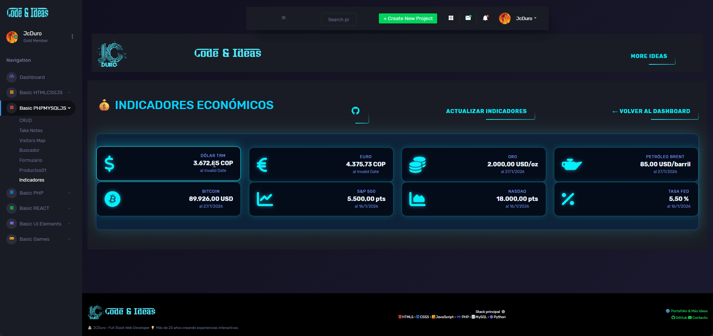

## 📈 Dynamic Indicator Updater 📈

[](https://example.com/build)
[](https://github.com/yourusername/yourrepository/blob/main/LICENSE)

## 🚀 Descripción

This PHP project automatically updates a database of key financial indicators (USD/COP, EUR/COP, BTC/USD, Gold/USD, Brent Crude/USD) 
using data from multiple APIs. It includes fallback mechanisms and error handling to ensure consistent updates even when API connections 
are temporarily unavailable.  This script is designed for simple integration and can be easily extended to monitor more currencies or assets.

---

## 🌟 Características

*   **Multi-API Support:**  Fetches data from ExchangeRate-API (for USD/COP and EUR/COP) and CoinGecko (for BTC/USD).
*   **Fallback Mechanisms:** Uses hardcoded values (e.g., 4000 for USD/COP) as fallbacks if API connections fail.
*   **Automatic Updates:**  Runs automatically (schedule this yourself – not included in the script).
*   **Error Handling:** Includes robust try-catch blocks and informative messages to diagnose and address issues.
*   **Database Integration:**  Stores indicator values in a database for easy access and reporting.  (See "Database" section below).
*   **Configurable API Key:**  Allows you to easily change your ExchangeRate-API key.
*   **Clear Logging:**  Provides detailed logging to the console for debugging and monitoring.

---

## 🛠️ Tecnologías Utilizadas

*   **PHP:** 8.1 or higher
*   **PDO:**  PHP Data Objects - for database interaction.
*   **JSON:**  For parsing API responses.
*   **`file_get_contents`:** For fetching data from URLs.
*   **`stream_context_create`:**  For managing HTTP requests (timeouts, headers).

---

## 🖼️ Vista previa



--- 

## 🚀 Demo
[Indicadores](https://jcduro.bexartideas.com/proyectos/dashjc/indicadores/indicadores.php)

---

## 📊 Lenguajes y Herramientas

[](https://skillicons.dev)


---

## ⚙️ Base de Datos (Database)

*   **Database:** MySQL / MariaDB (Recommended)
*   **Table Name:** `indicadores`
*   **Columns:**
    *   `codigo` (VARCHAR(20)):  Indicator code (e.g., 'USD_COP').  PRIMARY KEY
    *   `valor` (DECIMAL(10, 2)): Indicator value.
    *   `fecha` (DATE):  Date of the update.

    **Example SQL:**

    ```sql

CREATE TABLE `indicadores` (
  `id` int(11) NOT NULL,
  `codigo` varchar(20) NOT NULL,
  `nombre` varchar(50) NOT NULL,
  `valor` float(18,4) NOT NULL,
  `unidad` varchar(20) NOT NULL,
  `fecha` date NOT NULL
) ENGINE=InnoDB DEFAULT CHARSET=utf8mb4 COLLATE=utf8mb4_unicode_ci;

--
-- Volcado de datos para la tabla `indicadores`
--

INSERT INTO `indicadores` (`id`, `codigo`, `nombre`, `valor`, `unidad`, `fecha`) VALUES
(1, 'USD_COP', 'Dólar TRM', 3667.6863, 'COP', '0000-00-00'),
(2, 'EUR_COP', 'Euro', 4397.0566, 'COP', '0000-00-00'),
(3, 'ORO_USD', 'Oro', 2000.0000, 'USD/oz', '2026-02-01'),
(4, 'BRENT_USD', 'Petróleo Brent', 85.0000, 'USD/barril', '2026-02-01'),
(5, 'BTC_USD', 'Bitcoin', 76441.0000, 'USD', '2026-02-01'),
(6, 'SP500_USD', 'S&P 500', 5500.0000, 'pts', '2026-01-17'),
(7, 'NASDAQ_USD', 'Nasdaq', 18000.0000, 'pts', '2026-01-17'),
(8, 'FED_RATE', 'Tasa FED', 5.5000, '%', '2026-01-17');

    ```

## ⚙️ Configuración (Configuration)

1.  **Obtén una API Key:** You'll need a free API key from ExchangeRate-API ([https://www.exchangerate-api.com/](https://www.exchangerate-api.com/)).
2.  You'll also need a CoinGecko API key ([https://pro.coingecko.com/api/documentation](https://pro.coingecko.com/api/documentation)).
3.  **Reemplaza `TU_KEY_AQUI`:** In the PHP code, replace the placeholder `'TU_KEY_AQUI'` with your actual API key.  Make sure to save the file.
4.  **Database Credentials:**  Configure your database connection details (host, username, password, database name) in the PHP code.

## 🚀 Cómo Ejecutar (How to Run)

1.  **Save the code:** Save the provided PHP code as a `.php` file (e.g., `indicator_updater.php`).
2.  **Set up your database:** Create the `indicadores` table in your MySQL database.
3.  **Update the configuration:**  Replace `TU_KEY_AQUI` with your API key.
4.  **Execute the script:**  Run the PHP script from your terminal using `php indicator_updater.php`.
5.  **Schedule the script:** Use a task scheduler (like cron) to automatically run the script on a regular basis.

## 💡 Contribuciones (Contributions)

We welcome contributions to this project!  If you have any ideas, bug reports, or pull requests, please submit them through GitHub.


--- 

## 📄 Licencia
Libre, usalo como quieras
<div align="center">
  Hecho con 💙 y neones
</div>

---
